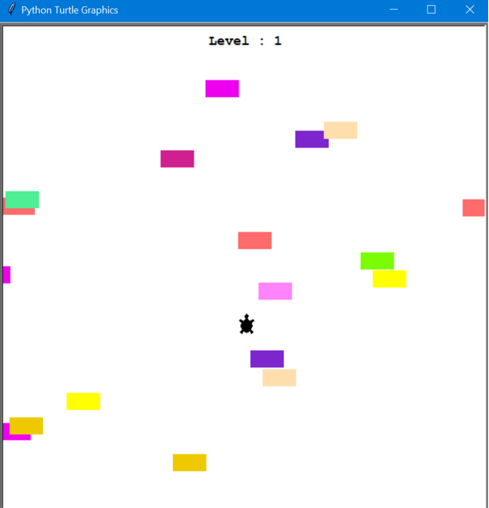

# Turtle-Crossing
bunnysaini/Turtle-Crossing

## Features
A Turtle Graphics supported Turtle crossing game, to make it cross the screen with an incoming flow of traffic.

## Instructions to Use
- Control the turtle's forward motion by 🠑 key 
- Make the turtle cross without hitting the incoming cars.
- The speed of the cars increases in successive levels.

## Result

